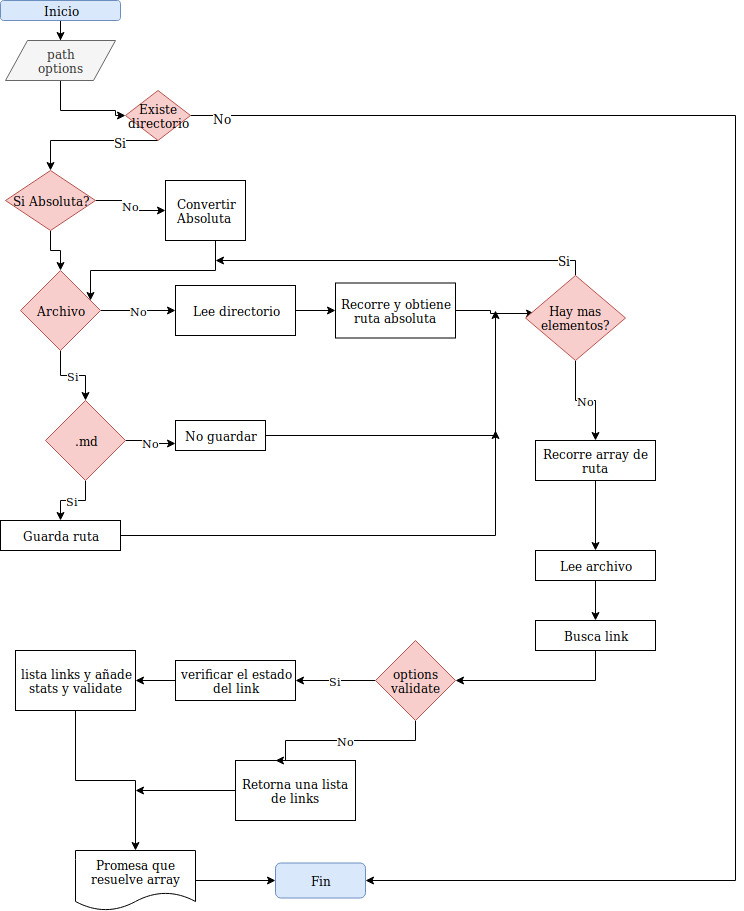

# Markdown Links
---
[md-links003](https://www.npmjs.com/package/md-links003) es una librería que lee y analiza archivos en formato `Markdown`, para verificar los links que contengan y reportar
algunas estadísticas.

## Instalación
npm i --g md-links003
### Uso (CLI)

#### `md-links PATH --stats --validate`
---
- Por ejemplo:
---
```sh
$ md-links ./some/example.md
ruta: ./some/example.md, link: http://process.com/2/3/, texto: process
ruta: ./some/example.md, link: http://google.com/ texto: Google
```
#### `md-links PATH --validate`
```sh13d99df067c1
$ md-links ./some/example.md --validate ó --stats
ruta: ./some/example.md, link: http://process.com/2/3/, ok, 200, texto: process
ruta: ./some/example.md, link: https://ppt.net/algun-doc.html, fail, 404, ppt
```
#### `md-links PATH --stats`
```sh
$ md-links ./some/example.md --stats ó --validate
Total: 3
Unique: 3
```
#### `md-links PATH --stats --validate`
```sh
$ md-links ./some/example.md --stats --validate
Total: 3
Unique: 3
Broken: 1
```

### Uso (API)
```js
import mdLinks from 'md-links003';

mdLinks('./some/path', { validate: true })
  .then(links => console.log(links))
  .catch(error => console.log(error));
```
#### `mdLinks(path, options)`
##### Argumentos

- `path`: Ruta absoluta o relativa al archivo o directorio. Si la ruta pasada es
  relativa, debe resolverse como relativa al directorio desde donde se invoca
  node - _current working directory_).
- `options`: Un objeto con las siguientes propiedades:
  * `validate`: Booleano que determina si se desea validar los links
    encontrados.

##### Valor de retorno

La función debe retornar una promesa (`Promise`) que resuelva a un arreglo
(`Array`) de objetos (`Object`), donde cada objeto representa un link y contiene
las siguientes propiedades:

- `href`: URL encontrada.
- `text`: Texto que aparecía dentro del link (`<a>`).
- `file`: Ruta del archivo donde se encontró el link.

#### Ejemplo

```js
const mdLinks = require("md-links");

mdLinks("./some/example.md")
  .then(links => {
    // => [{ href, text, file }]
  })
  .catch(console.error);

mdLinks("./some/example.md", { validate: true })
  .then(links => {
    // => [{ href, text, file, status, ok }]
  })
  .catch(console.error);

mdLinks("./some/dir")
  .then(links => {
    // => [{ href, text, file }]
  })
  .catch(console.error);
```
```sh
$ md-links ./some/example.md --stats
Total: 3
Unique: 3
```
---
## Flujograma
---

---
## documentación técnica de la librería.
#### Metodología: Scrum
#### Duración: 3 semanas.
[Github project](https://github.com/nayruthCalla/LIM009-fe-md-links/projects/1)

### Recursos que se utilizaron

- [Acerca de Node.js - Documentación oficial](https://nodejs.org/es/about/)
- [Node.js file system - Documentación oficial](https://nodejs.org/api/fs.html)
- [Node.js http.get - Documentación oficial](https://nodejs.org/api/http.html#http_http_get_options_callback)
- [Node.js y npm](https://www.genbeta.com/desarrollo/node-js-y-npm)
- [Asíncronía en js](https://carlosazaustre.com/manejando-la-asincronia-en-javascript/)
- [NPM](https://docs.npmjs.com/getting-started/what-is-npm)
- [Publicar packpage](https://docs.npmjs.com/getting-started/publishing-npm-packages)
- [Crear módulos en Node.js](https://docs.npmjs.com/getting-started/publishing-npm-packages)
- [Leer un archivo](https://nodejs.org/api/fs.html#fs_fs_readfile_path_options_callback)
- [Leer un directorio](https://nodejs.org/api/fs.html#fs_fs_readdir_path_options_callback)
- [Path](https://nodejs.org/api/path.html)
- [Linea de comando CLI](https://medium.com/netscape/a-guide-to-create-a-nodejs-command-line-package-c2166ad0452e)

⌨️  < LABORATORIA /> [Sobre mi](https://www.linkedin.com/in/carmen-nayruth-calla-mamani-a26164188/) 😊
